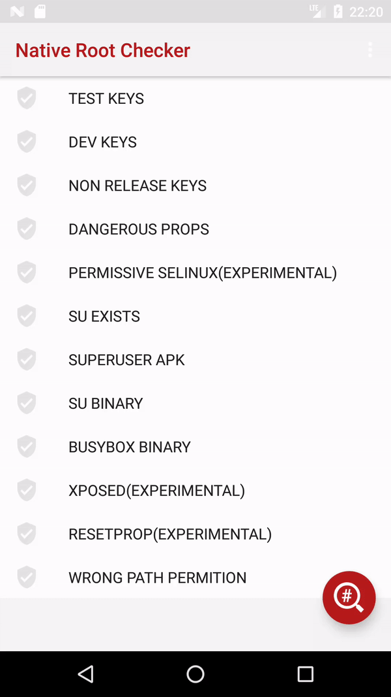

# meat-grinder 
A native root checker for Android devices and sample app.

Remeber! Detecting and hiding root are a cat and mouse game.

# Root checks

These are the native checks:

* TEST KEYS
* DEV KEYS
* NON RELEASE KEYS
* DANGEROUS PROPS
* PERMISSIVE SELINUX(EXPERIMENTAL)
* SU EXISTS
* SUPERUSER APK
* SU BINARY
* BUSYBOX BINARY
* XPOSED
* RESETPROP(EXPERIMENTAL)
* WRONG PATH PERMITION
* HOOKS

### False positives

Note that sometimes the `bool isFoundBusyboxBinary()` method can return a false positive.
This is cause the manufacturer of the device rom has left the busybox binary.
This alone doesn't mean that the device is rooted.

The following devices are known the have the busybox binary present on the stock rom:
* Part of the OnePlus Devices
* Part of the Xiaomi Devices

### Sample app

The sample app is published on Google play.

## Other libraries

You might like:

 * Scott Alexander-Bown and Mat Rollings' [RootBeer library](https://github.com/scottyab/rootbeer).
 
### Thanks
* [Juriy Koltsov](https://www.instagram.com/mypigpeppa/) for graphics design

# Licence

MIT License

Copyright (c) 2017 Dmitrii Kozhevin <kozhevin.dima@gmail.com>

Permission is hereby granted, free of charge, to any person obtaining a copy
of this software and associated documentation files (the "Software"), to deal
in the Software without restriction, including without limitation the rights
to use, copy, modify, merge, publish, distribute, sublicense, and/or sell
copies of the Software, and to permit persons to whom the Software is
furnished to do so, subject to the following conditions:

The above copyright notice and this permission notice shall be included in all
copies or substantial portions of the Software.

THE SOFTWARE IS PROVIDED "AS IS", WITHOUT WARRANTY OF ANY KIND, EXPRESS OR
IMPLIED, INCLUDING BUT NOT LIMITED TO THE WARRANTIES OF MERCHANTABILITY,
FITNESS FOR A PARTICULAR PURPOSE AND NONINFRINGEMENT. IN NO EVENT SHALL THE
AUTHORS OR COPYRIGHT HOLDERS BE LIABLE FOR ANY CLAIM, DAMAGES OR OTHER
LIABILITY, WHETHER IN AN ACTION OF CONTRACT, TORT OR OTHERWISE, ARISING FROM,
OUT OF OR IN CONNECTION WITH THE SOFTWARE OR THE USE OR OTHER DEALINGS IN THE
SOFTWARE.
